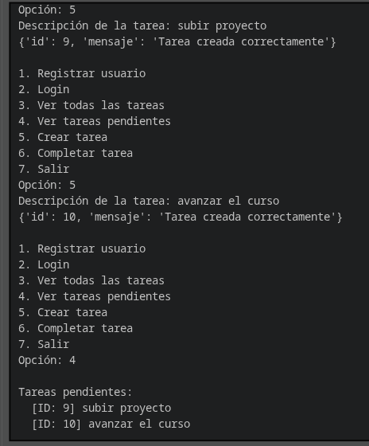
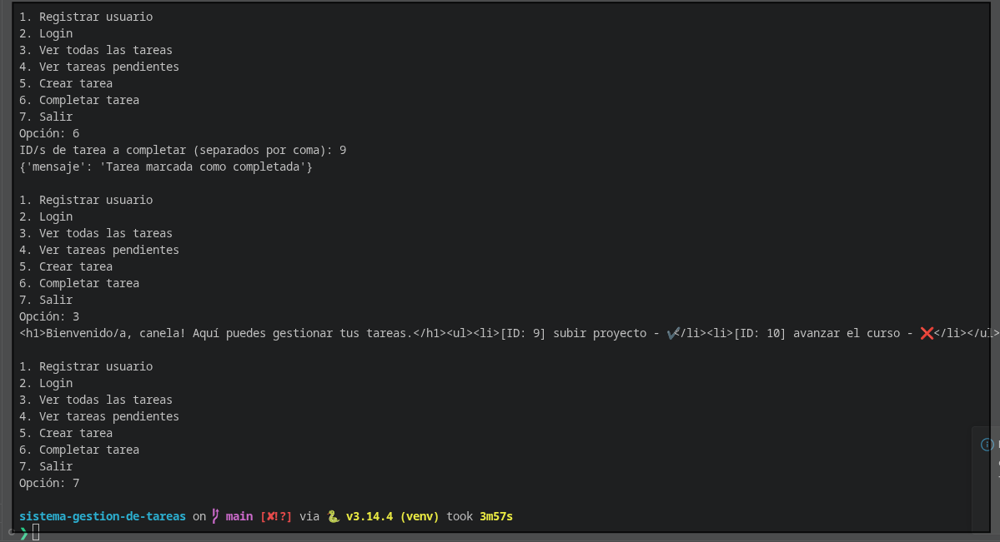
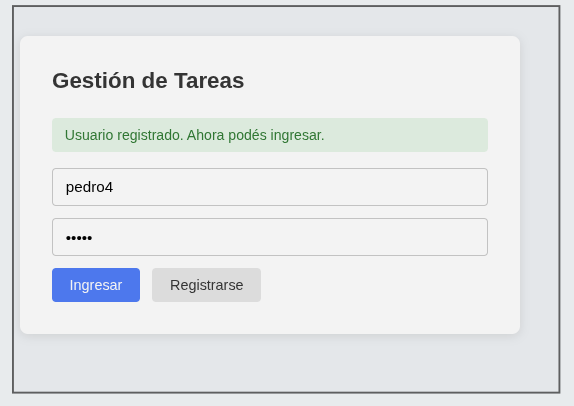
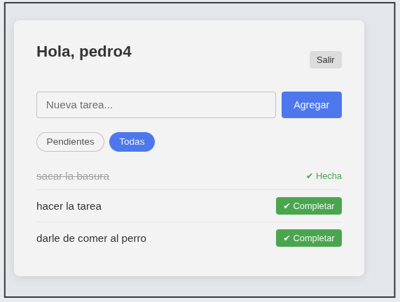
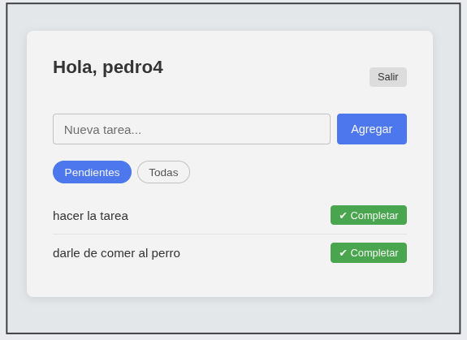

# Registro de Pruebas

## Cliente de consola

### Registro de usuario y login

Registro del usuario "canela" y login exitoso con generación de token JWT.

### Crear tareas y ver pendientes

Creación de dos tareas ("subir proyecto" ID:9, "avanzar el curso" ID:10) y listado de tareas pendientes con sus IDs.

### Completar tarea y ver todas

Completar la tarea ID:9, visualización de todas las tareas con estado (✔️/❌) y salida del cliente.

---

## Interfaz web

### Registro de usuario

Registro del usuario "pedro4" con mensaje de confirmación en la UI web.

### Vista "Todas" las tareas

Vista de todas las tareas: "sacar la basura" marcada como hecha, dos tareas pendientes con botón Completar.

### Vista "Pendientes"

Vista filtrada de tareas pendientes con botón Completar en cada una.
